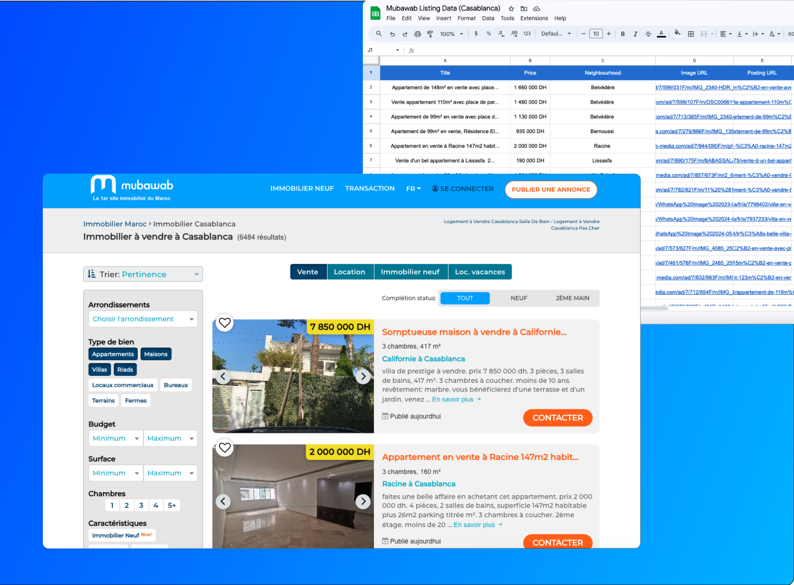

# Mubawab Real Estate Scraper

## Overview

The Mubawab Real Estate Scraper is a Python-based web scraping tool designed to collect real estate listings from Mubawab, a popular real estate website in Morocco. This tool extracts information such as the listing title, price, neighborhood, image URL, posting URL, property type, size, and number of rooms. The collected data is saved into a CSV file for further analysis and usage.

## Features

- **Scrapes Multiple Pages**: Configured to scrape multiple pages of listings automatically (up to 200).
- **Detailed Information Extraction**: Extracts comprehensive details including property type, size, number of rooms, price, neighborhood, and more.
- **Handles Missing Data**: Incorporates retry logic for missing data to ensure maximum information retrieval.
- **Randomized Delays**: Uses random delays between requests to avoid getting blocked by the server.
- **CSV Output**: Saves the scraped data into a CSV file for easy access and analysis.

## Project Structure

The project is structured into different modules for better readability and maintenance:

### `scrape_listings.py`

This is the main entry point of the scraper which orchestrates the scraping process.

### `scraper.py`

Contains the main scraping logic, including functions to scrape individual pages and compile the results.

### `utilities.py`

Provides utility functions for extracting detailed information from individual listings.

